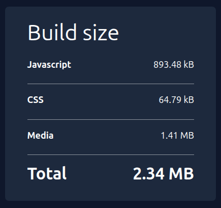

Big one again.

### why 😐

Every time I make an update to this website, I get increasingly frustrated and
disappointed by the bundle size produced by Next.js.



The modern features also make the website slow to load, reduce Lighthouse
scores, and make a simple static website unnecessarily complex. The latest
update made the website consistently take **3 seconds** to load, during which a
skeleton UI is shown - this is apparently a **great feature** developed by
Next.js called Cache Components.

Because this project is literally just 3 sites and a single API endpoint, the
decision of what to do _next_ (🙃) was pretty easy.

In order prevent this project from getting too complex and vendor-locked-in, I
have **removed Next.js** entirely and replaced it with **Astro**. It consisted
of 13 commits, and this post is itself one of the first visible benefits - it's
a plain Markdown file in `src/content/blog` now instead of hardcoded text in
Firestore.

The core of it landed in a single commit with a very familiar shape:

```
feat: migrate to Astro, rewrite blog posts to use Markdown, rewrite page
views to use Upstash Redis, rewrite build size to be dynamically computed
and uploaded to Upstash Redis, optimize images, remove chat and typewriter
dependencies, remove Firebase
```

I did it again. At least the twelve commits after it were small and focused.

### What changed

- **Astro instead of Next.js** - At first, I wanted to roll my own static
  website bundler using Bun and Vite somehow, but I realized Astro already has
  everything I need: static content by default, minimal JS bundles, and Markdown
  support.
- **Blog posts as Markdown** via Astro content collections, instead of being
  fetched from a database at runtime.
- **Firebase is gone.** Page views and build size now live in **Upstash Redis**,
  which means one less Firebase project to manage in my console.
- The **"Build size" card** is computed at build time by a Bun script and pushed
  to Redis **automatically**, instead of me updating it by hand.
- The homepage **chart** dropped chart.js in favor of a hand-rolled inline SVG
  line chart - fewer dependencies and lower complexity.
- Rolled my own **typewriter effect** to reduce bundle size, since it didn't
  seem to be too complicated to implement.
- **Vercel Analytics and Speed Insights**, plus better Open Graph metadata.
- SEO and a11y quality passes.
- JS bundle size reduced from **~900kB** to **~200kB**.
- Image optimizations - total size reduced from **~1.5MB** to **~700kB**.

### Thoughts for the future

This website still relies on Vercel for hosting (as evident by the
[leopetrovic.vercel.app](https://leopetrovic.vercel.app) domain name).

However, I do own a Cloudflare domain (feel free to visit my
[FSRE Timetable Notify project](https://fsre-app.mapokapo.cc)).

...and I do own an Oracle VPS (which is running my
[FSRE Timetable Notify backend](https://github.com/FSRE-Timetable-Notify/fsre-timetable-notify-backend),
used by my newly released [FSRE App](https://github.com/mapokapo/fsre-app) which
is available on
[Google Play](https://play.google.com/store/apps/details?id=com.fsre.mobileapp)).

...so I could technically roll my entire infrastructure. It would also mean I
could get rid of Upstash Redis - one less dependency.

But this is good enough for now.

After all, my biggest pain with this project was not Vercel but Next.js itself -
Vercel has not gone rotten (yet). It has some useful features I don't want to
lose out on (analytics, optimization, easy and quick deployment), so I'm putting
that suggestion into my magic hat of possible improvements.

Maybe I'll get to it one day.
